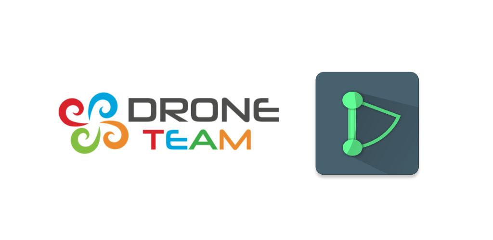

# DronE

## About project
This app is a part of an international project: DroneTeam. App helps with organising parts of your drone and presents countries that had taken part in the project.

## Drones database

Most useful thing is that you can save a configuration of your parts for specific drone. You can input a name for the components like: telemetry, bluetooth, propellers and many many more. Don't forget to take a photo ;)

## Participants

In DroneTeam have taken a part 4 schools from Poland, Spain, Croatia and Slovenia. Every team provided something useful and in the app you can find short description and photo of these groups.

## School localization

When you are flying drone it is important to know buildings in your nearest area. From app select school and you will be automatically moved to this place in a map.

## Elevation

I have made a big effort to make this app useful. DronE allows you to check difference in height so you can easily plan how to fly. Point two places on the map and app will show a popup with needed informations.

License
--------

    Copyright 2019 Tomasz Kądziołka.

    Licensed under the Apache License, Version 2.0 (the "License");
    you may not use this file except in compliance with the License.
    You may obtain a copy of the License at

       http://www.apache.org/licenses/LICENSE-2.0

    Unless required by applicable law or agreed to in writing, software
    distributed under the License is distributed on an "AS IS" BASIS,
    WITHOUT WARRANTIES OR CONDITIONS OF ANY KIND, either express or implied.
    See the License for the specific language governing permissions and
    limitations under the License.
